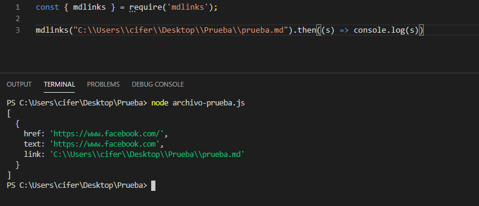
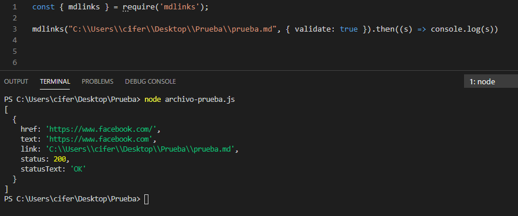

# Markdown Links 🔗

## Descripción 👁‍🗨

Muchas veces los archivos markdown contienen links (vínculos) que están caídos y el/la autor(a) necesita revisar cual de ellos sigue en funcionamiento para no perjudicar su trabajo.
Por ello este proyecto consiste en crear una herramienta para analizar que links son válidos en el archivo markdown (.md).

## Diagrama de flujo (API) 📚

## Diagrama de flujo (CLI) 📋

## **Guia de instalacion** 💿
Si deseas instalar `md-links` de forma global:
~~~
npm install git://github.com/syaker/LIM012-fe-md-links/
~~~

Si deseas instalarlo como una dependencia:

~~~
npm install --save --dev git://github.com/syaker/LIM012-fe-md-links/
~~~

## **Funcionamiento** 🚀

## Importar como modulo

~~~
const { mdlinks } = require('mdlinks')
~~~
Ejemplo:

✔ **Solo ruta**

---

✔ **Ruta y validate**

## En consola 💻

### **Opciones** 📑

|md-links|path|--stats|--validate|Resultado                            |
|------  |----------------|------:|------:   |---								   |
|------  |✅              |❌    |❌        | Solo ruta => todos los links, texto y ruta donde se hallo el link |
|------  |✅              |✅    |❌        | Ruta + stats => total de links y links unicos|
|------  |✅              |❌    |✅        | Ruta + validate => links validados, texto y ruta donde se hallo el link    |
|------  |✅              |✅    |✅        | Ruta + stats + validate => total de links, unicos y rotos|
---
✔ **Para encontrar todos los links en archivos .md**
~~~
md-links ruta/a/analizar
~~~
Ejemplo:

---

✔ **Validar los links encontrados**
~~~
md-links ruta/a/analizar --validate
~~~
Ejemplo:

---

✔ **Obtener total de links y links unicos**
~~~
md-links ruta/a/analizar --stats
~~~
Ejemplo:

---

✔ **Obtener total de links, links unicos y rotos**
~~~
md-links ruta/a/analizar --stats --validate
~~~
Ejemplo:

**igualmente colocando** `--validate --stats`
~~~
md-links ruta/a/analizar --validate --stats
~~~

---

⚠ **Errores comunes**
---
☑ **Ruta invalida**

---

☑ **Opcion invalida**

---

☑ **Opciones no estipuladas**

---

## Objetivos de aprendizaje ✅

### Javascript
- [x] Uso de callbacks
- [x] Consumo de Promesas
- [x] Creacion de Promesas
- [x] Modulos de Js
- [x] Recursión

### Node
- [x] Sistema de archivos
- [x] package.json
- [x] crear modules
- [x] Instalar y usar modules
- [x] npm scripts
- [x] CLI (Command Line Interface - Interfaz de Línea de Comando)

### Testing
- [x] Testeo de tus funciones
- [x] Testeo asíncrono
- [ ] Uso de librerias de Mock
- [x] Mocks manuales
- [ ] Testeo para multiples Sistemas Operativos

### Git y Github
- [ ] Organización en Github

### Buenas prácticas de desarrollo
- [x] Modularización
- [x] Nomenclatura / Semántica
- [x] Linting
